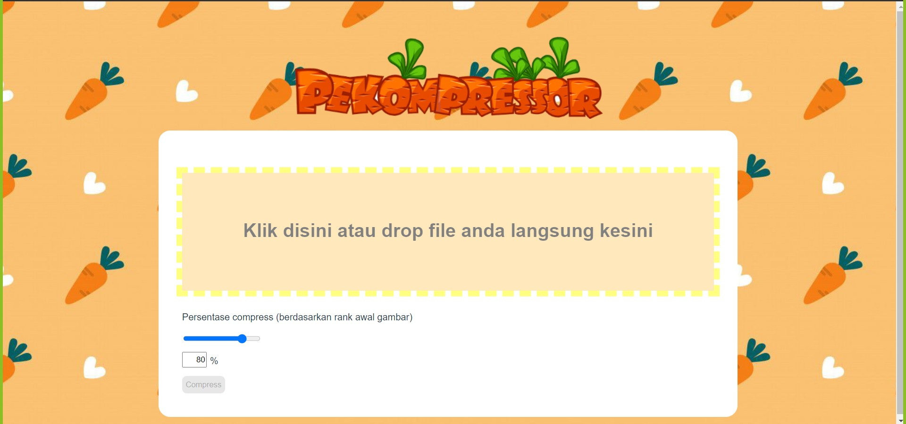
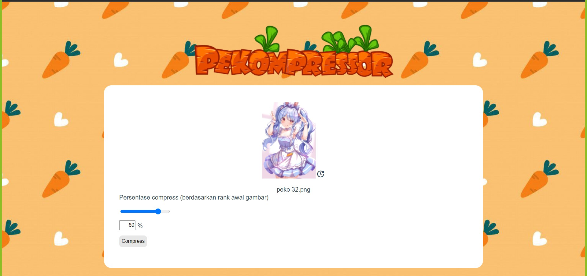
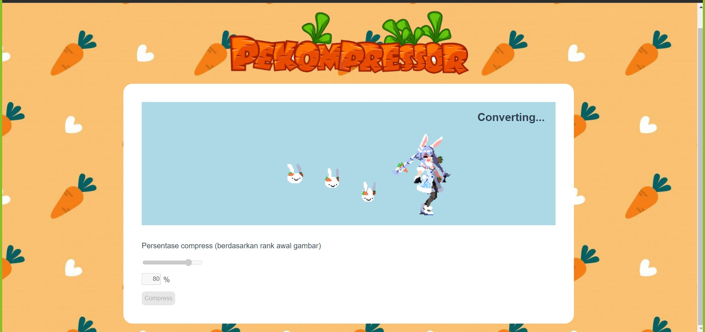
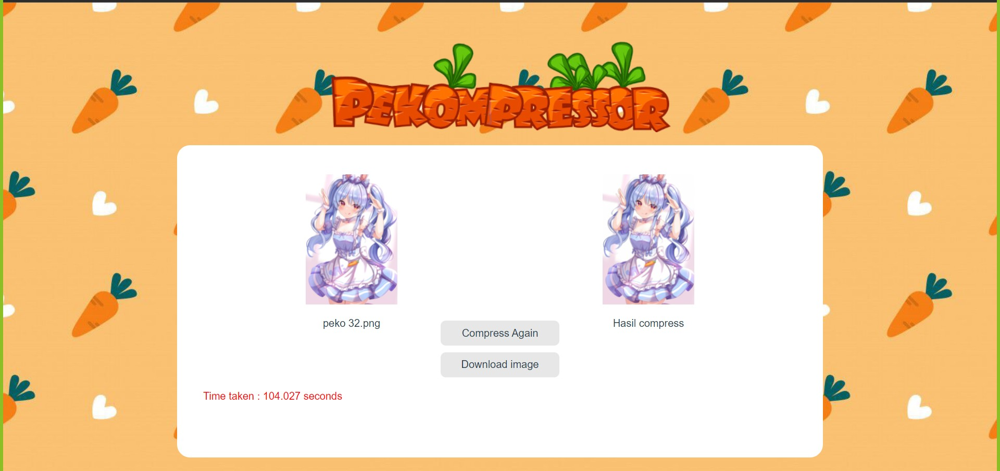

# Pekompressor
> Website yang bisa melakukan kompresi gambar.

## Table of Contents
* [Features](#features)
* [Screenshots](#screenshots)
* [Setup](#setup)
* [Usage](#usage)
* [Room for Improvement](#room-for-improvement)
* [Acknowledgements](#acknowledgements)

## Features
1. Kompresi gambar
2. Input dengan fitur drag and drop maupun memilih gambar dari folder
3. Pemilihan persen kompresi gambar berdasarkan rank

## Screenshots

## Setup
Dependencies:
-nodejs  
-vuejs  
-flask  
-axios  
-json-server  
-python 3.1:  
    a. numpy  
    b. pillow  
    c. scipy  
    d. base64  

Setting versi virtual environment python sesuai dengan versi python anda pada src/flaskpyvenv.cfg lalu include site-packages yang anda miliki agar bisa menggunakan pip

Aktifkan virtual environment di python pada folder src/flask/env/Scripts lalu run dengan ./activate dan kembali ke folder flask
Install menggunakan pip install module python:
1. pip install numpy
2. pip install pillow
3. pip install scipy
4. pip install base64
5. pip install flask
6. pip install flask-cors

Setup aplikasi
1. Download nodejs
2. Setelah menginstall nodejs, install vue menggunakan terminal OS dengan command "npm install vue"
3. Install vue-cli-service dengan command npm install -g @vue/cli
4. Install axios dengan command npm install axios pada folder src/vue
5. Install json dengan command npm install json-server

Untuk start program ini, kita perlu menyalakan 3 server yaitu flask,vue, dan json dengan run command di 3 terminal berbeda sebagai berikut:
1. flask  
    a. cd src/flask/env/scripts  
    b.  ./activate  
    c. cd ../..  
    d. python app.py  

2. vue  
    a. cd src/vue  
    b. npm run serve  

3. json  
    a. cd src/vue  
    b. npx json-server --watch Data/image.json cd src/vue  

## Usage
Setelah menyalakan ketiga server di atas, buka server yang disediakan oleh vue yaitu " http://localhost:8080/"

## Room for improvement
1. Mempercepat kompresi
2. Penentuan persentase kompresi yang lebih akurat
3. Input file dengan drag and drop masih belum dibatasi jenis filenya
4. Jika menerima input yang error server akan langsung error dan harus di start ulang
5. Menambahkan BGM Pekora

## Acknowledgements
- Project ini dilakukan untuk pemenuhan tugas besar 2 Aljabar Linear dan Geometri 2021
- Referensi yang digunakan pada tugas besar ini
1. Back-end
[this tutorial](https://testdriven.io/blog/developing-a-single-page-app-with-flask-and-vuejs/#bootstrap-setup).
2. Front-end
[this tutorial](https://www.udemy.com/course/build-web-apps-with-vuejs-firebase/).
